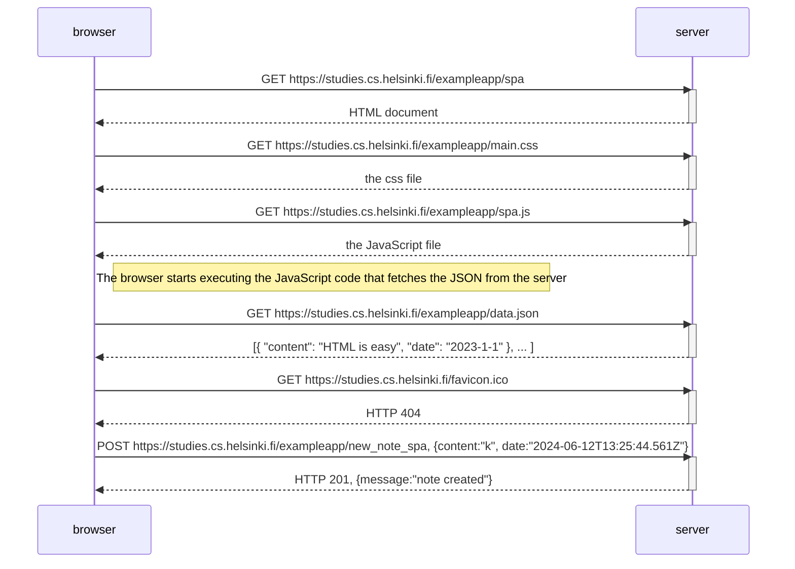

```mermaid
sequenceDiagram
    participant browser
    participant server

    browser->>server: GET https://studies.cs.helsinki.fi/exampleapp/spa
    activate server
    server-->>browser: HTML document
    deactivate server

    browser->>server: GET https://studies.cs.helsinki.fi/exampleapp/main.css
    activate server
    server-->>browser: the css file
    deactivate server

    browser->>server: GET https://studies.cs.helsinki.fi/exampleapp/spa.js
    activate server
    server-->>browser: the JavaScript file
    deactivate server

    Note right of browser: The browser starts executing the JavaScript code that fetches the JSON from the server

    browser->>server: GET https://studies.cs.helsinki.fi/exampleapp/data.json
    activate server
    server-->>browser: [{ "content": "HTML is easy", "date": "2023-1-1" }, ... ]
    deactivate server

    browser->>server: GET https://studies.cs.helsinki.fi/favicon.ico
    activate server
    server-->>browser: HTTP 404
    deactivate server

    browser->>server: POST https://studies.cs.helsinki.fi/exampleapp/new_note_spa, {content:"k", date:"2024-06-12T13:25:44.561Z"}
    activate server
    server-->>browser: HTTP 201, {message:"note created"}
    deactivate server


```